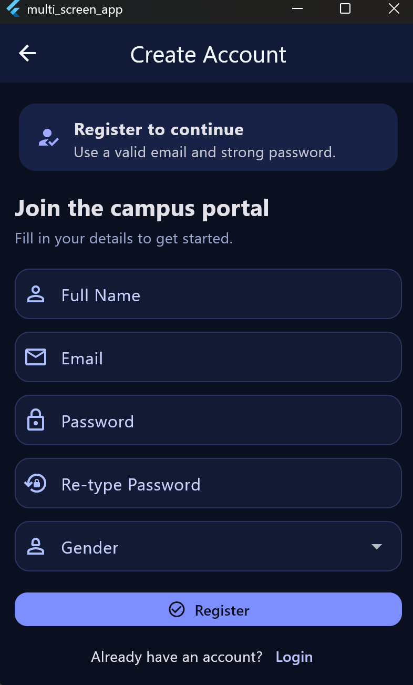
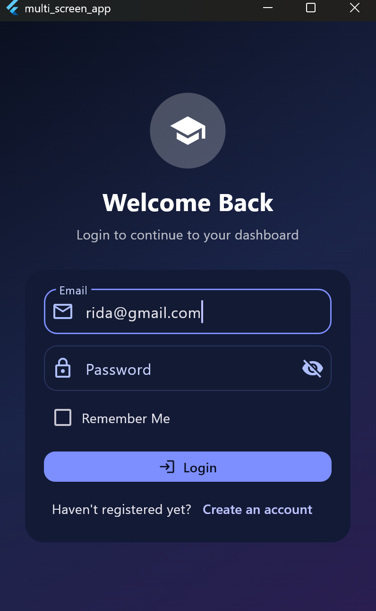
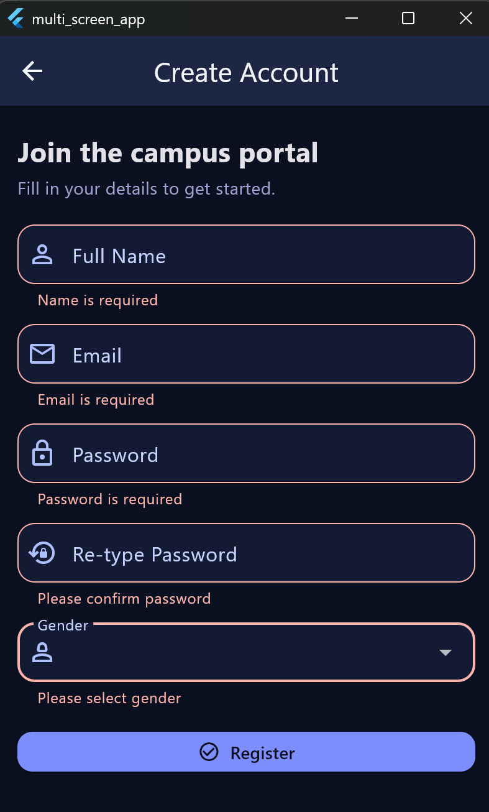
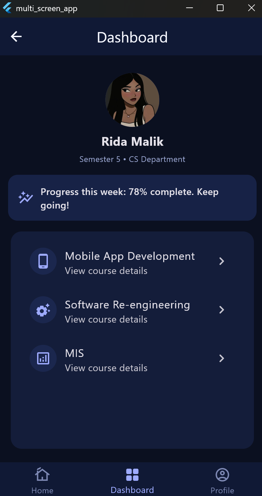
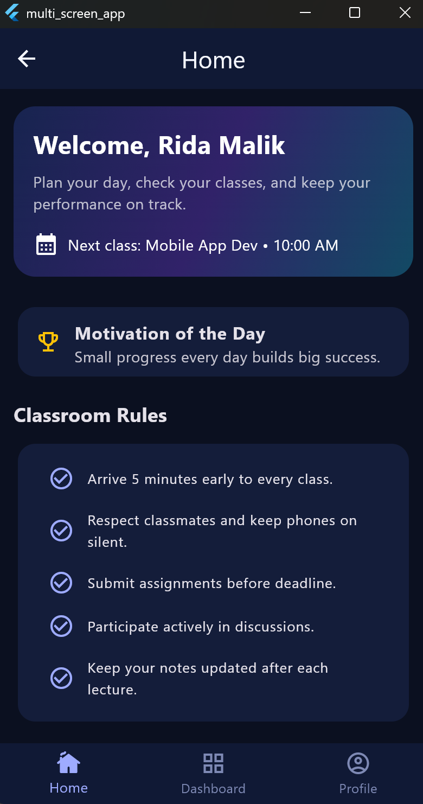
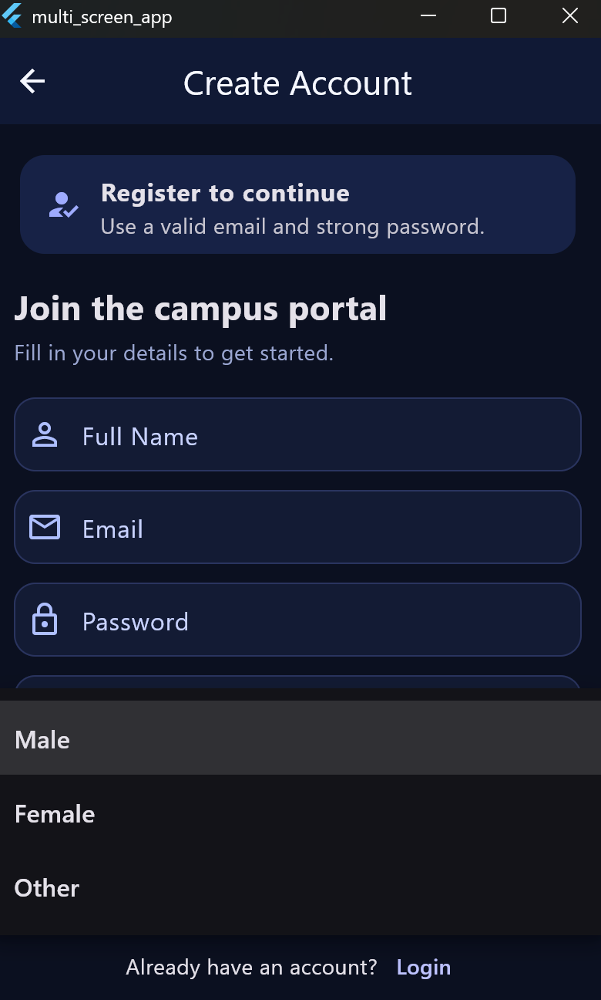
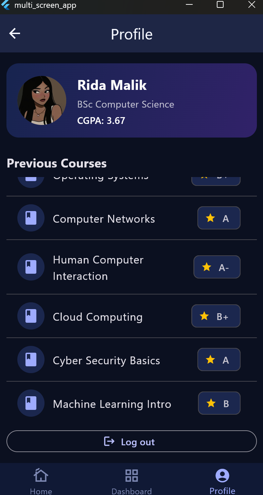
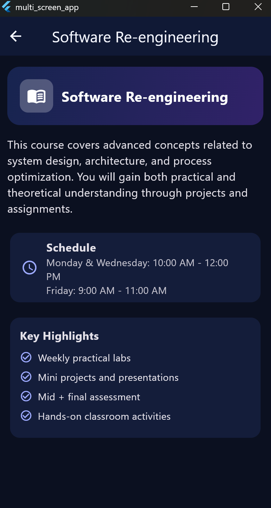

# 📱 Multi Screen Flutter App

A frontend-based Flutter application featuring dynamic UI, form validation, and local data persistence using Shared Preferences.

---

## 📸 Application Screenshots

### 🔐 Authentication Flow
**Registration Screen**


**Login Screen**


**Form Validation**


---

### 📊 Dashboard & Features
**Main Dashboard**


**Home Screen**


**Dropdown Implementation**


---

### 👤 User Profile & Navigation
**Profile Screen**


**Inner Content**


---

## 🛠️ Features Implemented
* **Shared Preferences:** Registered data (Name/Email) is stored locally and displayed dynamically on the Login and Profile screens.
* **Smart Validation:** Real-time feedback on registration forms to ensure correct data entry.
* **Seamless Navigation:** Smooth transition between Authentication, Dashboard, and Inner screens.
* **Modern UI:** Clean dark-themed design with custom Flutter widgets.

## 🚀 How to Run
1. Clone this repository:
   ```bash
   git clone <your-repo-link>
