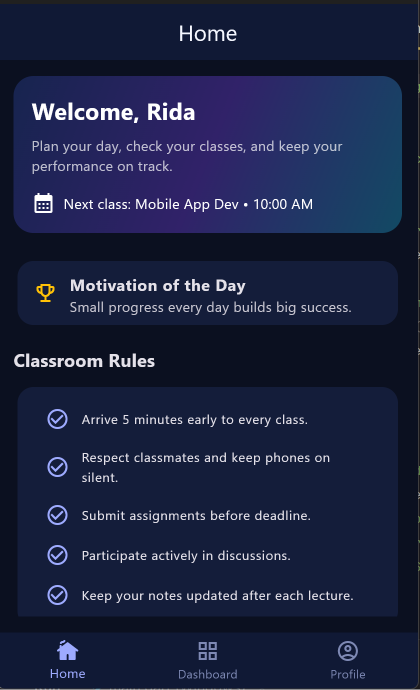
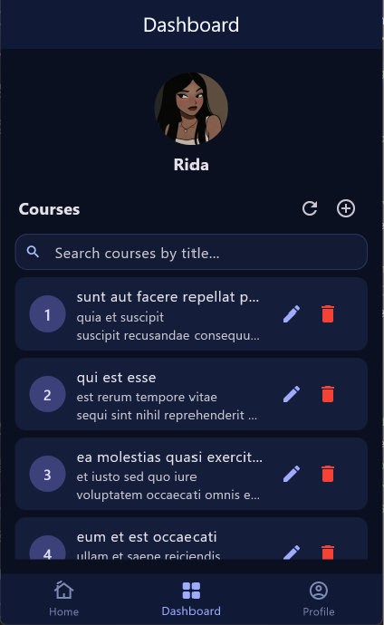
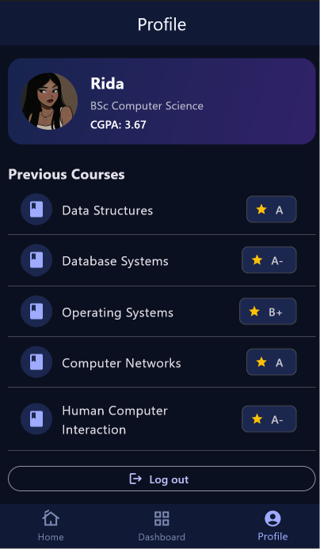
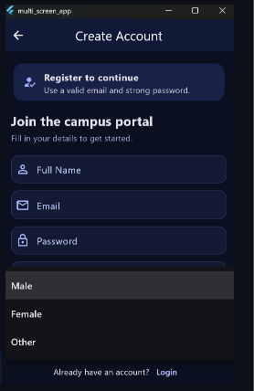
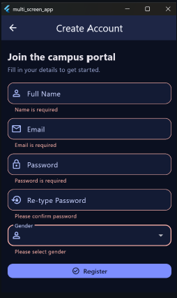
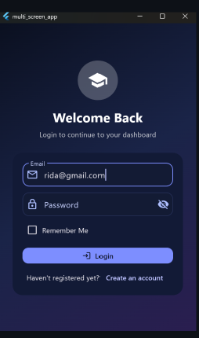

# LMS App (Flutter)

A Learning Management System (LMS) mobile app built with **Flutter & Dart**, featuring user authentication, profile management, and CRUD operations powered by a REST API, with local session persistence via Shared Preferences.

## Features

- **User Authentication** — Login and Registration screens with form validation
- **Home Dashboard** — Landing screen showing welcome message and quick access to app sections
- **Profile Management** — View and manage user profile details
- **Dropdown / Selection UI** — Dynamic dropdown component for selecting options within the app
- **CRUD Operations via API** — Create, Read, Update, and Delete operations integrated with a backend REST API
- **Local Storage (Shared Preferences)** — Session/login state and user data persisted locally on the device

## Tech Stack

- **Framework:** Flutter (Dart)
- **Local Storage:** `shared_preferences`
- **Networking:** REST API (`http` package)
- **State Management:** Stateful widgets / setState

## Screens

<table>
  <tr>
    <td align="center"><b>Home</b> </td>
    <td align="center"><b>CRUD + API</b> </td>
    <td align="center"><b>Profile</b> </td>
  </tr>
  <tr>
    <td align="center"><b>Dropdown</b> </td>
    <td align="center"><b>Registration</b> </td>
    <td align="center"><b>Login</b> </td>
  </tr>
</table>

## Local Storage — Shared Preferences

The app uses the `shared_preferences` package to persist data locally on the device, such as:
- Login/session state (so the user stays logged in across app restarts)
- Basic user info for quick access without repeated API calls

## CRUD & API Integration

CRUD operations (Create, Read, Update, Delete) are implemented by calling REST API endpoints from within the app. This covers actions like adding, viewing, updating, and removing records relevant to the LMS.

## Getting Started

### Prerequisites
- Flutter SDK installed
- Android Studio / VS Code with Flutter & Dart plugins
- A configured backend API (update the base URL in the API service file)

### Installation
